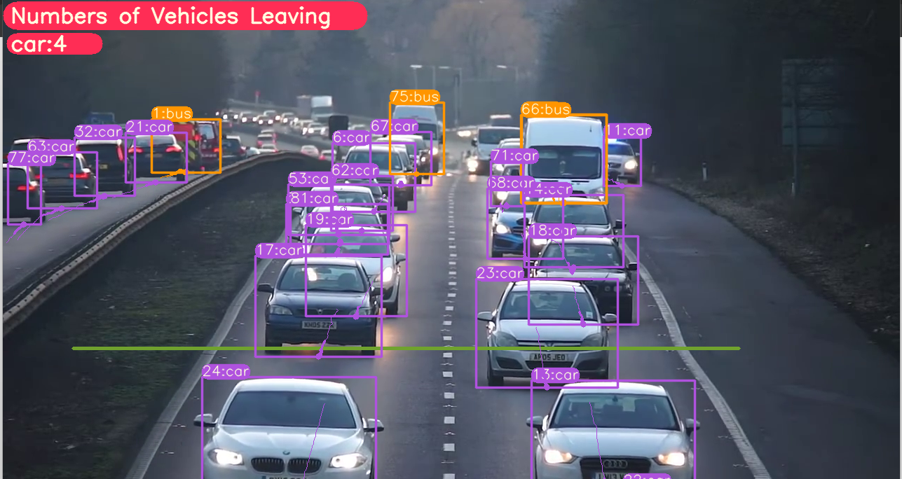
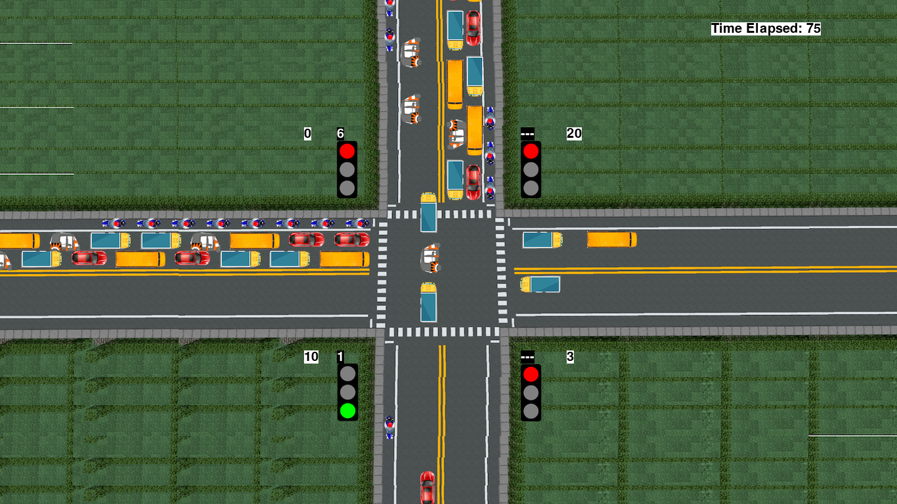

<H1 align="center">
YOLOv8 Object Detection with DeepSORT Tracking(ID + Trails) </H1>


## Steps to run Code

- Clone the repository
```
git clone https://github.com/Navyaraman/Yolo_object_tracking
```
- Goto the cloned folder.
```
cd YOLOv8-DeepSORT-Object-Tracking
```
- Install the dependecies
```
pip install -e '.[dev]'

```

- Setting the Directory.
```
cd ultralytics/yolo/v8/detect

```
- For yolov8 object detection + Tracking + Vehicle Counting
```
python predict.py model=yolov8l.pt source="4.mp4" show=True
```


-For simulation 
```
python simulation.py
```

